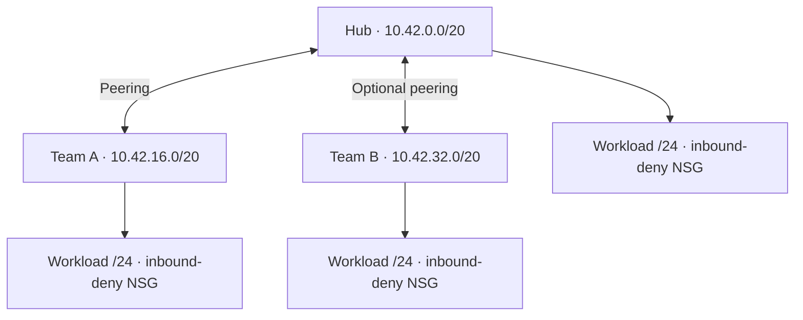

# Five-minute demo: onboarding a second Azure application team

**By Bailey Fitchett · Azure · Terraform · Platform engineering**

Demonstrate how an optional second spoke can be added while preserving Team A and hub configuration. The repository implements the networking increment and tests its configuration contracts; independent team deployment authority remains future work.

**No Azure subscription or credentials are needed for this walkthrough.** All test runs use a mocked AzureRM provider and `command = plan`. No Azure resources are created.

## Before the interview

Install Git and **Terraform 1.9.8**, the version used by the linked CI run, and allow internet access to download the locked provider. Complete setup before the five-minute presentation; download time varies.

The commands below work in PowerShell or Bash. Use a fresh checkout so local variable files or edits do not change the demonstrated inputs.

```shell
# Clone a separate copy of the public lab and enter its root module.
git clone https://github.com/baileynyx/azure-platform-foundation.git azure-platform-demo
cd azure-platform-demo

# Confirm the Terraform version matches the recorded CI baseline.
terraform version

# Install the committed provider version without configuring a state backend.
# Read-only locking prevents an incidental provider upgrade during the demo.
terraform init -backend=false -input=false -lockfile=readonly
```

Stop if a command fails; resolve the reported setup error before proceeding. If provider downloads are unavailable, present the [recorded CI evidence](#recorded-evidence) and test source instead of claiming a new local run.

## 0:00–0:45 — State the problem

Team A already has a network. Team B needs its own allocation and ownership metadata without renaming Team A resources or changing the hub configuration.

The increment must preserve the default single-team configuration, reject reserved allocations, and keep the existing inbound-deny contract. Show [the input example](examples/two-teams.example.tfvars) and [the implementation](main.tf).

## 0:45–1:30 — Explain the architecture



Each workload subnet uses the first /24 of its VNet. All resources share one resource group and one root state. Each spoke has both peering directions to the hub; there is no direct Team A–Team B peering. Forwarded traffic and gateway transit are disabled.

The module declares a deny-all-inbound rule at priority 4096, with no application allow rules. Outbound rules remain Azure defaults. This diagram describes configured resources, not measured connectivity or enforced separation of team permissions.

## 1:30–3:00 — Run the validation

Run each command from the repository root and stop on any failure.

```shell
# Check source formatting and validate configuration against provider schemas.
terraform fmt -check -recursive
terraform validate

# Run all configuration tests: five foundation runs and twelve two-team runs.
# The test files explicitly replace AzureRM with a mock provider and use plan only.
terraform test -no-color
```

Expected: formatting exits successfully with no output; validation reports `Success! The configuration is valid.`; the full test suite ends with:

```text
Success! 17 passed, 0 failed.
```

The [two-team test file](tests/two_teams.tftest.hcl) supplies its own scenario variables. There is no need to copy the example into `terraform.tfvars`, authenticate to Azure, or run a standalone `terraform plan`.

For a focused rerun during questions, use the path syntax for your operating system. See the [Terraform test command reference](https://developer.hashicorp.com/terraform/cli/commands/test#example-test-directory-structure-and-commands).

On Linux or macOS (Bash):

```shell
# Select only the twelve Team B regression and invalid-input runs.
# This includes the single-team baseline used by later comparison assertions.
terraform test -no-color -filter=tests/two_teams.tftest.hcl
```

On Windows (PowerShell):

```powershell
# Windows test-file selection uses a native path, quoted for PowerShell.
terraform test -no-color -filter='tests\two_teams.tftest.hcl'
```

Expected summary: `Success! 12 passed, 0 failed.` This is the selected subset, not twelve additional tests.

## 3:00–4:15 — Explain the assertions

| Test run or group | What to point out |
| --- | --- |
| `single_team_baseline` | Team B defaults off, its module and peerings are absent, and Team A can have an owner distinct from the hub. |
| `onboard_team_b` | Compares Team A and hub configured output values with the baseline; checks Team B's /20, first /24, VNet/NSG owner tags, inbound-deny fields and both peering instances' restrictions. |
| `custom_team_b_allocation` | Uses `10.60.0.0/16` and slot 15, producing `10.60.240.0/20` for Team B. |
| `disable_team_b_again` | Returns to the baseline configured outputs and zero Team B peerings. This is not a deployed destroy or rollback test. |
| Eight `reject_*` runs | Expect validation failures for blank/null owners and reserved, negative, out-of-range or fractional allocations. Correct rejection makes each test pass. |
| Five foundation runs | Cover default network/ownership behavior, invalid environment/owner/CIDR inputs, and the child module's inbound-deny contract. |

The two-team regression compares configured output fields, not every possible Azure property. Mocked values and green assertions do not prove live routing, NSG enforcement, permissions, or a safe state migration.

## 4:15–5:00 — Explain the tradeoffs

- **Compatibility:** retain `module.spoke` and the original Team A peering addresses. Team B gets a separate optional module with the stable key `team_b`.
- **Predictable allocation:** reserve slots 0 and 1 for the hub and Team A; allow Team B integer slots 2–15. A real deployment still needs a check against the organization's network inventory.
- **Ownership:** owner tags identify responsibility. Separate resource scopes, remote state access and deployment identities would be needed to enforce independent team authority.
- **Connectivity and recovery:** production work would need approved narrow allow rules, protected deployment, positive/negative connectivity checks, and a reviewed teardown. After a real deployment, disabling Team B would plan resource removal.

For the fuller rationale, open the [engineering case study](docs/second-team-case-study.md).

## Recorded evidence

| Evidence | Result and scope |
| --- | --- |
| [Implementation PR #4](https://github.com/baileynyx/azure-platform-foundation/pull/4) | Merged optional Team B networking, ownership inputs, examples and regression tests. |
| [Post-merge CI run](https://github.com/baileynyx/azure-platform-foundation/actions/runs/34384005592) | September 9, 2026: formatting, locked provider initialization, validation and all 17 mock test runs passed. |
| [Verified source commit](https://github.com/baileynyx/azure-platform-foundation/commit/98bdcc4e57e8f1baca785a350ccacd413b434943) | Exact implementation revision associated with that CI result. |
| [Validation record](VALIDATION.md) | Historical baseline and second-team implementation results. |

The setup commands check out the current default branch; the evidence above is tied to the named commit. Future test changes may change expected counts. No live Azure deployment, packet-flow test or teardown is claimed.

[Project overview](README.md) · [Bailey's profile](https://github.com/baileynyx)
