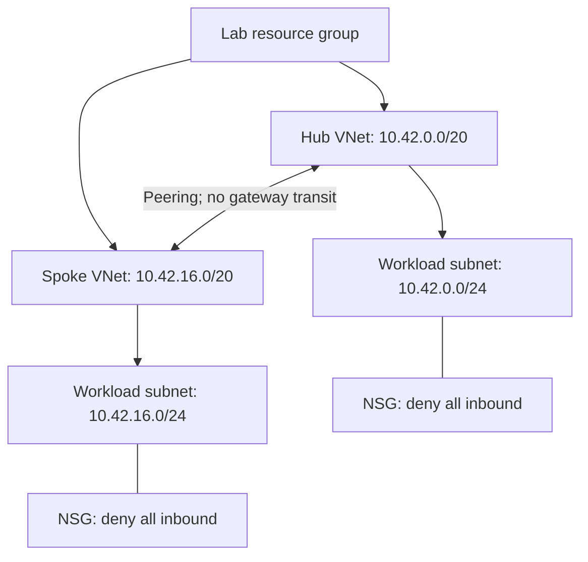

# Azure platform foundation

A small subscription-level Terraform networking foundation: one resource group, two peered VNets, one subnet per VNet, and associated NSGs with explicit inbound deny rules. Ownership and lifecycle tags are consistent across taggable resources.

**This is an independent networking lab, not a complete enterprise landing zone.** It contains no compute, managed firewall, gateway, public IP, or Azure deployment automation. CI validates without cloud credentials.

## Featured engineering case study

[Onboarding a second application team](docs/second-team-case-study.md): how state ownership, address allocation, connectivity approval and recovery would evolve beyond this lab. Includes links to the five passing tests and explicit acceptance gates for the proposed extension.

## Five-minute review

Install Terraform 1.9 or later (less than 2.0). Provider installation requires internet access.

```shell
terraform init -backend=false
terraform fmt -check -recursive
terraform validate
terraform test
```

Mock tests use the real provider schema and synthetic computed values. They verify configuration contracts, not Azure permissions, service availability or packet flow. See `VALIDATION.md` for checks actually executed.

## Architecture



Peering creates routes; it does not override the NSGs. There are no allow rules or workloads. Default Azure outbound rules remain, so this is not a design for controlled egress. The network module keeps subnets separate from VNet inline configuration to avoid competing resource ownership.

## Decisions

| Decision | Rationale and tradeoff |
| --- | --- |
| Derive two /20 VNets from one /16 | Prevent overlap within this deployment; check the /16 against the real estate before using it. |
| One reusable network module | Makes the hub/spoke resource contract consistent without hiding a large framework. |
| Override the default VNet inbound allow | Make traffic intent explicit. Adding a workload requires reviewed narrow allow rules. |
| Tag validation | Provides ownership metadata, not policy enforcement across a subscription. |
| Local state for an isolated lab | Makes the demo small; unsuitable for team deployment. Remote state is a separate bootstrap responsibility. |
| AzureRM 4.x compatibility line | A deliberate baseline tested by CI; evaluate major upgrades in a separate change. |

For an enterprise landing zone, evaluate [Azure Verified Modules and Microsoft's implementation options](https://learn.microsoft.com/en-us/azure/cloud-adoption-framework/ready/landing-zone/implementation-options), management groups, policy, identity, logging, DNS, routing and remote state. A custom networking module is not a substitute for that work.

## Optional real Azure rehearsal

Real deployment is manual and was not performed as part of this package. It requires Azure CLI, a selected disposable subscription, and permissions to manage resource groups and networking. The provider deliberately disables automatic resource-provider registration; an administrator must register `Microsoft.Network` in advance.

In PowerShell:

```powershell
az login
$subscription = az account show --query id -o tsv
if ($LASTEXITCODE -ne 0 -or -not $subscription) { throw 'Select an Azure subscription first.' }
$env:ARM_SUBSCRIPTION_ID = $subscription.Trim()
az account show --query '{subscription:name,id:id}' -o table
terraform init
terraform plan -out=lab.tfplan
terraform show lab.tfplan
terraform apply lab.tfplan
```

Before apply, confirm the subscription and allocation, review the plan and current Azure pricing. Peering traffic can incur charges; lack of compute is not a promise of zero cost. Treat state and plan files as sensitive and keep them out of Git.

For a team workflow, bootstrap an Azure Storage backend independently, give the deployment identity only required access, use OIDC with environment-bound trust and protected deployment approval, and keep untrusted PR validation credential-free. That workflow is a documented extension, not an included deployment.

## Teardown

From the same checkout, state and selected subscription, run `terraform plan -destroy -out=destroy.tfplan`, inspect it with `terraform show destroy.tfplan`, then `terraform apply destroy.tfplan`. Confirm the resource group is gone. Preserve state until deletion is verified; then remove local plan/state copies according to your retention policy. Do not delete a shared state backend as part of workload teardown.
