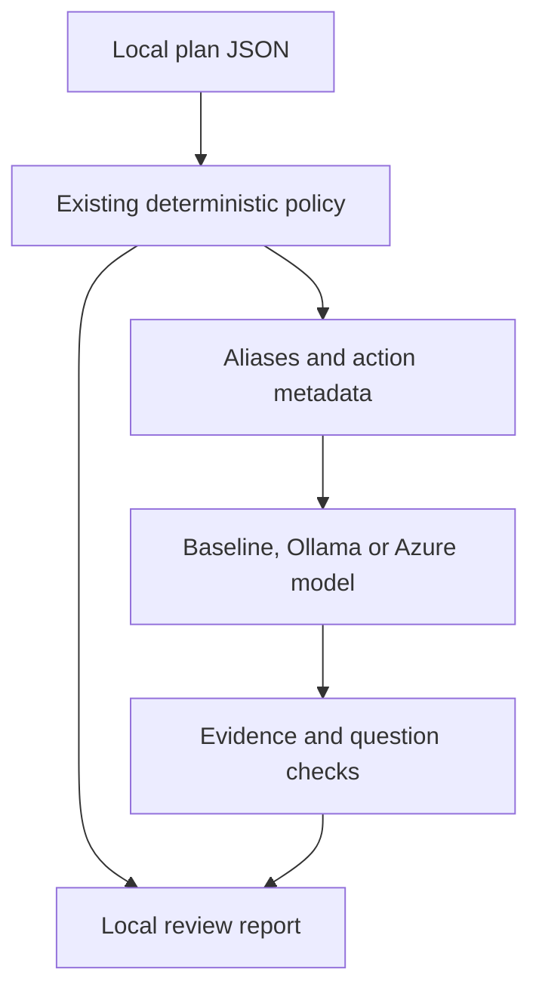

# AI assisted Terraform change review

This project explores a narrow question: can an AI model help select useful
infrastructure review questions while deterministic code retains control of
facts and policy decisions? It extends the existing Terraform action reviewer
with a Python CLI, local Ollama and Azure OpenAI v1 adapters, an evaluation corpus and a recorded
offline demonstration.

**Automated evidence is offline.** The baseline, adversarial probes and intercepted
HTTP tests pass. A user-run local Qwen review was rejected for confusing replacement
orders; a subsequent attempt omitted resource evidence. The
[Ollama walkthrough](ollama-review.md) documents the revised request schema.
No successful live corpus evaluation, reviewer time savings or production
readiness is claimed.

For real local inference without an Azure subscription, follow the
[Windows Ollama walkthrough](ollama-review.md). The commands below use the
deterministic baseline and do not load a model.

## Try it without credentials

From the repository root with Python 3.12 or later:

```shell
python ai_review.py examples/plans/safe.json --output-dir reports/ai-safe
python evaluate_ai_review.py --output-dir reports/ai-evaluation
python record_ai_demo.py --output-dir reports/ai-recording
```

Every output directory must be new. The baseline makes no network requests and
is explicitly labelled `deterministic_baseline`. No extra Python packages or
Terraform installation are required for these committed synthetic examples.

For a destructive plan:

```shell
python ai_review.py examples/plans/destructive.json --output-dir reports/ai-destructive
```

The expected exit is **1**, meaning the unchanged deterministic policy requires
review. Exit **0** means the narrow policy found no destructive resource actions;
it never authorizes apply. Exit **2** means invalid input, rejected AI output,
provider failure or an output error. Failure never falls back to an AI success.

Each successful review writes:

- `review.md`: explanations, questions and local evidence pointers.
- `review.json`: policy result, checked candidate, local evidence map and provenance metadata.
- `outbound.json`: the exact plan-derived projection included in the model request.

For real plans, the review files contain local resource addresses. Keep them
private. Only synthetic examples are uploaded by this repository's CI.

## Recorded demonstration

[Read the recorded terminal transcript](ai/recorded-demo/transcript.txt),
[inspect the example review](ai/recorded-demo/review.md), or
[inspect the evaluation result](ai/recorded-demo/evaluation.json).
The [asciicast recording](ai/recorded-demo/demo.cast) contains actual captured CLI
output with measured event times; an asciicast-compatible player can replay it.
The recording script labels temporary output directories with stable aliases.
Its very short duration measures local commands, not model response latency.

## Architecture and trust boundaries



`plan_review.review` still determines `review_required` versus
`no_destructive_changes`. The AI layer does not modify this policy, apply
Terraform, run commands, post PR comments or authenticate a plan.

The outbound allowlist contains only generated evidence IDs, managed/data mode,
action enums, category enums and one of three unknown-value labels. Resource
addresses, names, types, deposed keys, values, variables, outputs, configuration,
attribute names and the input hash remain local. The projection is assembled
from known fields rather than attempting to redact arbitrary input strings.
Action types and resource counts are still disclosed to the selected provider.

The model selects and orders questions from a fixed catalogue. Local code writes
the factual explanation. It checks every echoed action category and unknown-value
label against the input, requires exactly one finding for each resource, rejects
unknown/duplicate evidence IDs, and enforces relevant and mandatory questions.
Both replacement orders retain recovery questions; their different cutover and
interruption questions remain distinct. Data sources use state questions and are
not described as proof of infrastructure destruction.

`after_unknown` is validated as a nested boolean structure. Missing metadata is
`not_reported`; an explicit structure with no true flags is `none_marked`, which
is not a promise that the entire plan is known. Incomplete/deferred plan warnings
come directly from the existing policy, outside the model response.

The design deliberately limits AI creativity. It prevents fabricated operational
claims from entering the report, but it also means a deterministic question
catalogue may be equally useful. Demonstrating incremental value requires a
future blinded reviewer comparison; this release makes no superiority claim.

## Optional live Azure review

If you do not have an Azure OpenAI resource yet, use the
[isolated Terraform setup](../examples/ai-service/README.md). It includes
subscription/model checks, a host firewall rule, plan review and teardown.

Use an existing public Azure OpenAI resource and a deployment supporting chat
completions with strict JSON-schema output. No resource is provisioned by this
project. Live mode makes a paid inference request, subject to that deployment's
pricing and access controls. Start with the synthetic example below.

This complete PowerShell snippet prompts for configuration without storing the
key in a script or printing it. It clears the key when finished:

```powershell
$env:AZURE_OPENAI_ENDPOINT = Read-Host 'Azure OpenAI resource origin (HTTPS)'
$env:AZURE_OPENAI_DEPLOYMENT = Read-Host 'Deployment name supporting structured outputs'
$secureKey = Read-Host 'Azure OpenAI API key' -AsSecureString
$keyPointer = [Runtime.InteropServices.Marshal]::SecureStringToBSTR($secureKey)
try {
    $env:AZURE_OPENAI_API_KEY = [Runtime.InteropServices.Marshal]::PtrToStringBSTR($keyPointer)
    $runName = 'reports/ai-live-' + [Guid]::NewGuid().ToString('N')
    python ai_review.py examples/plans/destructive.json --provider azure --output-dir $runName
    if ($LASTEXITCODE -ne 1) { throw 'Live review did not produce the expected review-required result.' }
    Get-Content (Join-Path $runName 'review.md')
} finally {
    [Runtime.InteropServices.Marshal]::ZeroFreeBSTR($keyPointer)
    Remove-Item Env:AZURE_OPENAI_API_KEY -ErrorAction SilentlyContinue
    $secureKey.Dispose()
}
```

The adapter calls `/openai/v1/chat/completions`, supplies a strict JSON schema,
limits output to 4,096 completion tokens and response bytes to 128 KiB, uses a
30-second socket timeout, and makes no retries. It accepts only HTTPS origins
under `openai.azure.com`, rejects redirects, and does not inherit proxy settings.
Sovereign clouds, custom domains and Entra token refresh are outside this release.
Provider refusals, truncation, tool calls, inconsistent usage and malformed output
fail closed. HTTP error bodies and credentials are never written to reports.

Live results retain the returned model identifier, configured deployment,
request bytes, latency and provider-reported token counts. The deployment's
support for this API must be verified by a live run; transport tests alone do
not establish it.

## Evaluation and reproducibility

```shell
python -m unittest discover -s tests -p 'test_*.py' -v
python evaluate_ai_review.py --output-dir reports/ai-baseline-eval
```

There are 12 explicitly labelled synthetic cases: creation, update, deletion,
both replacement orders, unknown values, data-source read/removal, no-op,
incomplete and deferred plans, output-only plans, and embedded secrets/injection
text. Some cases cover several properties. Expected policy and unknown-value
labels are authored in the corpus, not inferred from the candidate response.

Thirteen separately constructed adversarial response probes exercise invented
citations, contradictory actions, hidden unknowns, missing required questions,
irrelevant questions, replacement-order confusion, duplicates, wrong types,
approval fields, arbitrary prose and omissions. These are validator probes, not
claims that a model generated or resisted those attacks.

With the same environment configured, run a live corpus evaluation explicitly:

```shell
python evaluate_ai_review.py --provider azure --output-dir reports/ai-live-evaluation
```

This attempts **12 inference requests**, one per case, with no automatic retries.
The report retains per-case candidates, returned model metadata and token/latency
measurements for successful calls. Failed calls remain counted as failures;
usage for failed requests is unavailable, so recorded token totals may be lower
than billed usage. Baseline totals are `null`, not invented zero-cost model
measurements. Evaluation exit 0 means all corpus contracts and validator probes
passed, exit 1 means a failed case/probe, and exit 2 is an evaluation setup error.

An offline candidate can also be inspected using `--provider replay --response`
with a JSON object containing only `findings`. Replay validates saved candidate
content but does not prove that a model produced it.

## Limits and references

This release supports at most 20 resource objects, a 10 MiB plan and 10,000
unknown-metadata nodes per resource. Oversized inputs fail instead of being
silently truncated. It does not evaluate attribute changes, costs, dependency
graphs, live outages, Terraform checks or output changes. The synthetic evaluation
is small and visible; it is not a held-out benchmark.

HashiCorp documents that Terraform JSON can expose sensitive values:
[terraform show](https://developer.hashicorp.com/terraform/cli/commands/show).
The adapter follows Microsoft's
[Azure v1 chat API](https://learn.microsoft.com/en-us/rest/api/microsoft-foundry/azureopenai/chat?view=rest-microsoft-foundry-v1)
and [structured output contract](https://learn.microsoft.com/en-us/azure/foundry/openai/how-to/structured-outputs).
For extending evaluation beyond these contract checks, see
[Microsoft's AI observability guidance](https://learn.microsoft.com/en-us/azure/foundry/concepts/observability).
